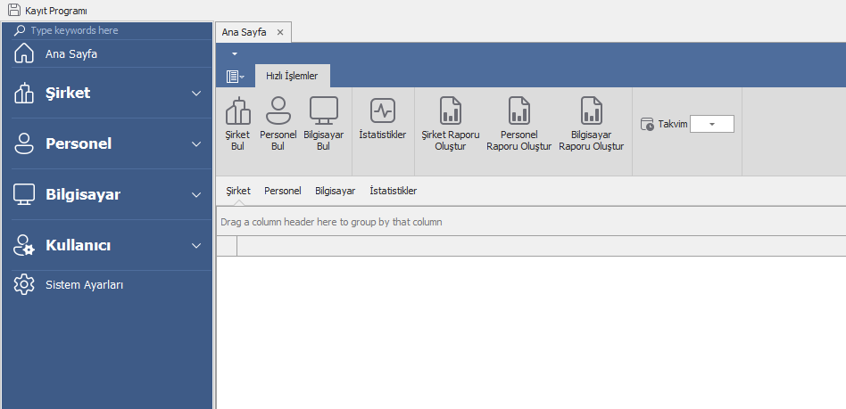
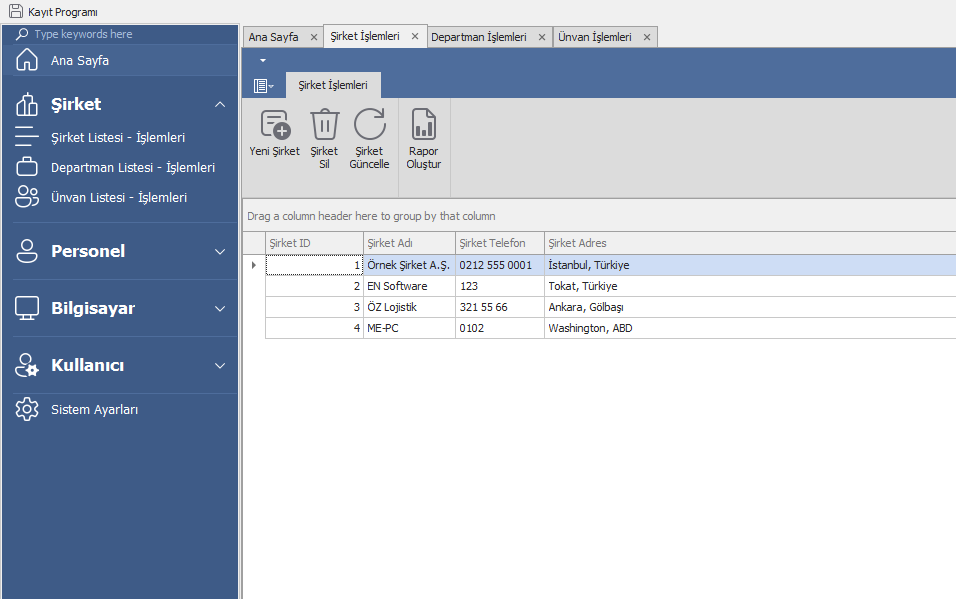
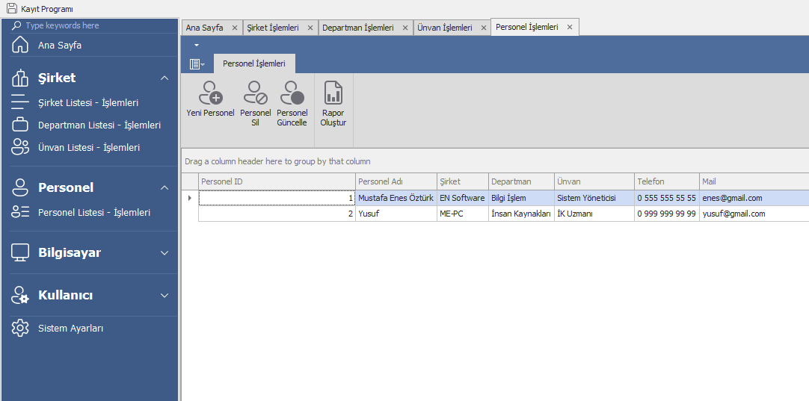
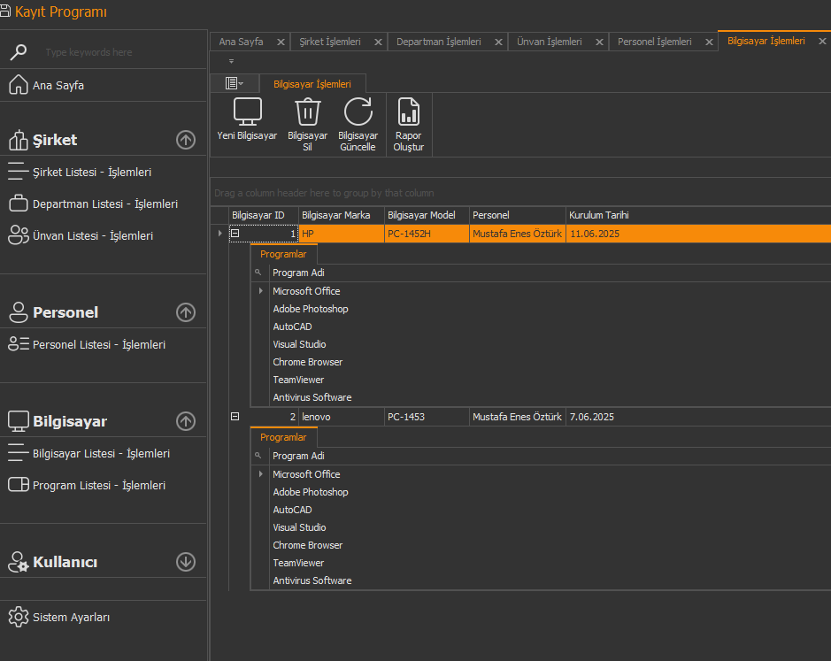
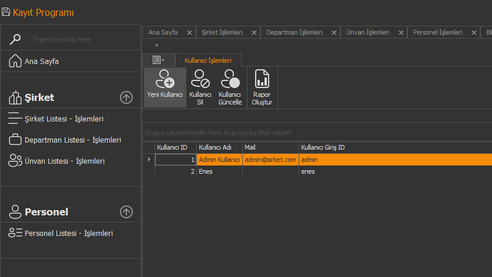
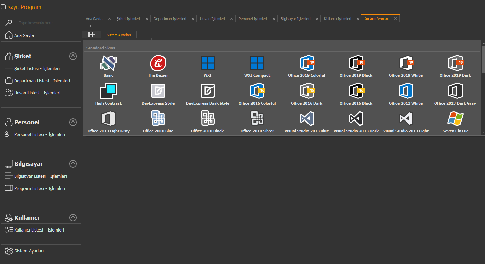
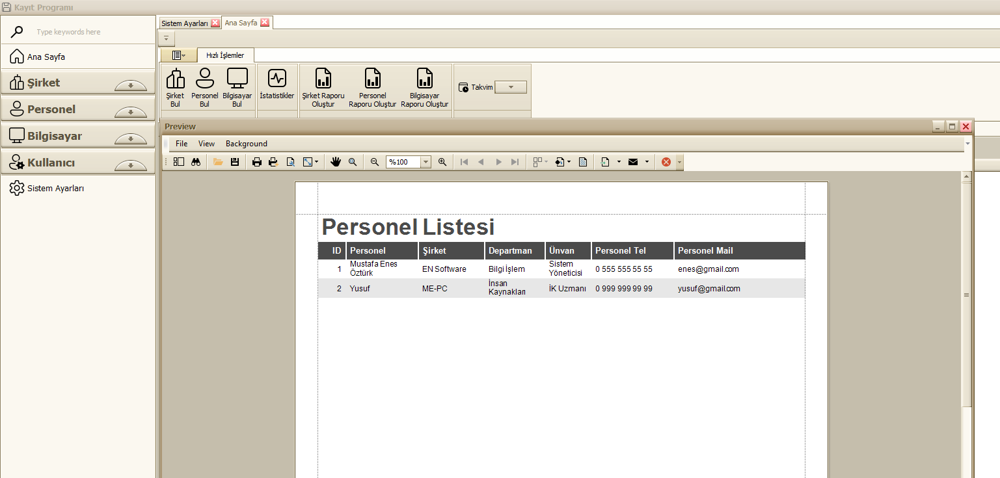

# PC Kayıt Programı

C# ve DevExpress ile geliştirilmiş personel ve bilgisayar takip sistemi.

## 📸 Proje Görselleri

### 🏠 Ana Sayfa

*Modern arayüz ve hızlı erişim menüleri*

### 🏢 Şirket Yönetimi

*Şirket bilgileri ve departman yönetimi*

### 👥 Personel Takibi

*Detaylı personel kayıtları ve bilgi yönetimi*

### 💻 Bilgisayar Envanteri

*Bilgisayar zimmet takibi ve donanım bilgileri*

### ⚙️ Admin Paneli

*Kullanıcı yönetimi ve sistem ayarları*

### 🎨 Tema Ayarları

*DevExpress tema desteği ve görsel özelleştirme*

### 📊 Rapor Sistemi

*Detaylı raporlama ve export özellikleri*

## ✨ Özellikler

- 👥 **Personel Yönetimi** - Ekle, düzenle, sil, detaylı kayıtlar
- 💻 **Bilgisayar Takibi** - Donanım envanteri ve zimmet işlemleri  
- 🏢 **Şirket Yönetimi** - Departman ve unvan organizasyonu
- 📊 **Raporlama** - Excel export ve detaylı raporlar
- 🔐 **Kullanıcı Sistemi** - Yetki bazlı erişim kontrolü
- 🎨 **Modern UI** - DevExpress tema desteği
- 🗄️ **Güvenli Veritabanı** - SQL Server entegrasyonu


## 📂 Klasör Yapısı

```
├── pcKayitProgram/     # Ana program
├── DBYukleyici/        # Veritabanı kurulum
└── projeiçerik/        # Proje görselleri
```

## 🔧 Kurulum

1. SQL Server Express kur
2. `DBYukleyici/Program.cs` dosyasında connection string düzenle
3. `pcKayitProgram/App.config` dosyasında server adını değiştir
4. DBYukleyici'yi çalıştır
5. Ana programı başlat

---

**Version:** 1.0 | **Developer:** Mustafa Enes Öztürk
